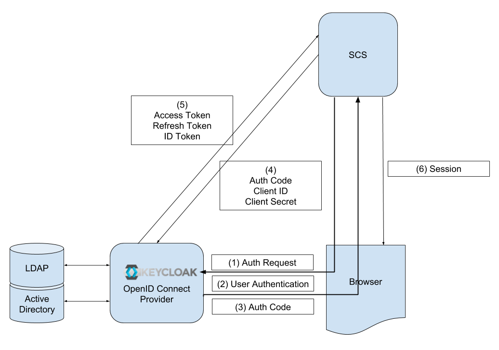

== Security

=== Introduction

Since more and more customers are sensitized to the topic of IT security, it is necessary to have an own security concept in place. Not only to satisfy the needs of the customers and not to be sold out due to lack of security but also for the case of an attack on the customer's system, not to be the entry point for the attackers, which would bring immense reputation harm.

=== Scope
The scope of this article is how to secure the software delivered by Swisslog to their customers. This includes the self-written software and third-party libraries used by this software. Its also includes the direct runtime environment for the software.

What it explicitly not include is any kind of infrastructure or network security.

=== Protection Requirement
Which protection level is necessary for the components of a system? To answer this question is the first step for a suited security solution.

The tradeoff between high security and the ability to do the business without higher limitations through the security and also the costs is the key point to find reasonable security measures.

To be able to make an informed decision is the target of the determination of the protection requirements.

==== Identification
For the identification of the protection requirements related to the categories, it is necessary to determine the individual impact for the own organization (and also for the customer who uses our software) for every damage scenario.

As an example: What is a limited and clear financial effect and what is an existentially threatening financial effect in euros?

The protection requirements also depend on the basic principles. Without of any confidential data in a system, there is no protection requirement for confidentiality.

A good way to get an insight is to ask: What happened if...?

==== Categories
Normally the protection requirements will be sorted into three categories:

normal: The damaging impact is limited and clear
high: The damaging impact can be considerably
very high: The damaging impact can reach an existentially threatening, catastrophic extent
By the determination of the protection requirement categories is the question to ask which damage can be caused if one of the basic principles will be violated.

==== Principles (Security Goals)
The principles or security goals are defined in order to reach and keep the information security and therefore to protect the data against deliberate attacks on the IT systems.

===== Basic
* Confidentiality
** In information security, confidentiality "is the property, that information is not made available or disclosed to unauthorized individuals, entities, or processes" (Excerpt ISO27000)
* Integrity 
** Data may not be changed without notice. All changes must be traceable
* Availability
** The access to the system must be possible

===== Additional
* Authenticity  
** Properties of the authenticity, verifiability and trustworthiness of an object
* Non repudiation  
** No inadmissible contesting of performed actions
* Accountability  
** An action performed can be clearly assigned to a user

==== Damage Scenarios
Every violation of the previous basic principles can cause one or more of the following damage scenarios:

* Violation of laws, instructions or contracts
* Impairments of informational self-determination
* Impairments of personal integrity
* Impairments of task fulfillment
* Negative external visibility (loss of reputation)
* Financial effects

As an example: If the order data in the database of a company gets corrupted or destroyed and cannot be restored are threaten the following damage scenarios:

* Orders can't be fulfilled (impairments of task fulfillment)
* Commitments against the customer can't be fulfilled (violation of contracts)
* Huge loss of income (financial effects)
* Loss of reputation by the customer (negative external visibility)

The importance of a scenario depends on the business of the affected organization. For an authority, the laws and the external visibility are very important, while for a company the most of the time the financial effects matters.

=== Attack Scenarios
The context of this concept is the protection of our self-written and third party software. Installed on site, in a data center or in the future also in the cloud to run a customers business. Therefore the context of the described attack scenarios are possible attacks on such systems. Other threats are not considered. Every serious attack has one or more goals, which the attacker wants to archive with his criminal action.

==== Attack Goals
The attack goals of cyber crime are very similar to these of of normal crime. In the case of crimes against property they can be reduced to espionage, sabotage and theft, but also the personality rights of employees and customers can be harmed.

===== Espionage
Espionage (colloquially, spying) is the obtaining of information considered secret or confidential without the permission of the holder of the information (https://en.wikipedia.org/wiki/Espionage).

In case of cyber espionage this can mean collecting secret information about the business of the company to get an advantage as a direct competitor. But it can also mean get information about employees or customers for observation or as starting point for other crimes.

===== Sabotage
Sabotage is a deliberate action aimed at weakening a polity or corporation through subversion, obstruction, disruption or destruction (https://en.wikipedia.org/wiki/Sabotage).

It can be done by so called script kiddies out of boredom, but it also can be done by a competitor to get an advantage in the market. In the worst case it can be done by a secret service as a part of a cyber war.

===== Theft
Theft is a criminal offense directed against foreign property, such as burglary, embezzlement, larceny, looting, robbery, shoplifting, library theft, and fraud (https://en.wikipedia.org/wiki/Theft).

In cyber crime, most of the time is theft very near to espionage, especially when it comes to data theft. But for a goods management system it also means obtaining money and physical goods. For example through manipulating orders or invoices.

==== Scenarios
A common practice to define the interesting attack scenarios on web applications is the top 10 list of attacks of the open web application security project (OWASP).

===== Injection
Injection flaws, such as SQL, OS, and LDAP injection occur when untrusted data is sent to an interpreter as part of a command or query. The attacker's hostile data can trick the interpreter into executing unintended commands or accessing data without proper authorization.

[cols="6", ,options="header"]
|===
| Threat Agents	| Attack Vectors 2+| Security Weakness | Technical Impacts | Business Impacts
| Application Specific | Exploitability EASY | Prevalence COMMON | Detectability AVERAGE | Impact SEVERE | Application / Business Specific
| Consider anyone who can send untrusted data to the system, including external users, internal users, and administrators. | Attacker sends simple text-based attacks that exploit the syntax of the targeted interpreter. Almost any source of data can be an injection vector, including internal sources. 2+|	Injection flaws occur when an application sends untrusted data to an interpreter. Injection flaws are very prevalent, particularly in legacy code. They are often found in SQL, LDAP, Xpath, or NoSQL queries; OS commands; XML parsers, SMTP Headers, program arguments, etc. Injection flaws are easy to discover when examining code, but frequently hard to discover via testing. Scanners and fuzzers can help attackers find injection flaws. | Injection can result in data loss or corruption, lack of accountability, or denial of access. Injection can sometimes lead to complete host takeover. |	Consider the business value of the affected data and the platform running the interpreter. All data could be stolen, modified, or deleted. Could your reputation be harmed?
|===

====== How to discover
The best way to find out if an application is vulnerable to injection is to verify that all use of interpreters clearly separates untrusted data from the command or query. For SQL calls, this means using bind variables in all prepared statements and stored procedures, and avoiding dynamic queries.

Checking the code is a fast and accurate way to see if the application uses interpreters safely. Code analysis tools can help a security analyst find the use of interpreters and trace the data flow through the application. Penetration testers can validate these issues by crafting exploits that confirm the vulnerability.

Automated dynamic scanning which exercises the application may provide insight into whether some exploitable injection flaws exist. Scanners cannot always reach interpreters and have difficulty detecting whether an attack was successful. Poor error handling makes injection flaws easier to discover

====== How to prevent
Preventing injection requires keeping untrusted data separate from commands and queries.

The preferred option is to use a safe API which avoids the use of the interpreter entirely or provides a parameterized interface. Be careful with APIs, such as stored procedures, that are parameterized, but can still introduce injection under the hood.
If a parameterized API is not available, you should carefully escape special characters using the specific escape syntax for that interpreter. OWASP's ESAPI provides many of these escaping routines.
Positive or 'white list' input validation is also recommended, but is not a complete defense as many applications require special characters in their input. If special characters are required, only approaches 1. and 2. above will make their use safe. OWASP's ESAPI has an extensible library of white list input validation routines.
https://www.owasp.org/index.php/Top_10_2013-A1-Injection

===== Broken Authentication and Session Management
Application functions related to authentication and session management are often not implemented correctly, allowing attackers to compromise passwords, keys, or session tokens, or to exploit other implementation flaws to assume other users' identities.

[cols="5", ,options="header"]
|===
| Threat Agents | Attack Vectors | Security Weakness | Technical Impacts | Business Impacts
| Application Specific | Exploitability AVERAGE | Prevalence WIDESPREAD | Detectability AVERAGE | Impact SEVERE	Application / Business Specific

| Consider anonymous external attackers, as well as users with their own accounts, who may attempt to steal accounts from others. Also consider insiders wanting to disguise their actions. 
| Attacker uses leaks or flaws in the authentication or session management functions (e.g., exposed accounts, passwords, session IDs) to impersonate users. 
| Developers frequently build custom authentication and session management schemes, but building these correctly is hard. As a result, these custom schemes frequently have flaws in areas such as logout, password management, timeouts, remember me, secret question, account update, etc. Finding such flaws can sometimes be difficult, as each implementation is unique. | Such flaws may allow some or even all accounts to be attacked. Once successful, the attacker can do anything the victim could do. Privileged accounts are frequently targeted. 
| Consider the business value of the affected data or application functions. 
Also consider the business impact of public exposure of the vulnerability.
|===

====== How to discover
Are session management assets like user credentials and session IDs properly protected? You may be vulnerable if:

User authentication credentials aren't protected when stored using hashing or encryption. See 4.2.6.
Credentials can be guessed or overwritten through weak account management functions (e.g., account creation, change password, recover password, weak session IDs).
Session IDs are exposed in the URL (e.g., URL rewriting).
Session IDs are vulnerable to session fixation attacks.
Session IDs don't timeout, or user sessions or authentication tokens, particularly single sign-on (SSO) tokens, aren't properly invalidated during logout.
Session IDs aren't rotated after successful login.
Passwords, session IDs, and other credentials are sent over unencrypted connections. See 4.2.6.
See the ASVS requirement areas V2 and V3 for more details.

====== How to prevent
The primary recommendation for an organization is to make available to developers:

* A single set of strong authentication and session management controls. Such controls should strive to:
meet all the authentication and session management requirements defined in OWASP's Application Security Verification Standard (ASVS) areas V2 (Authentication) and V3 (Session Management).
have a simple interface for developers. Consider the ESAPI Authenticator and User APIs as good examples to emulate, use, or build upon.
* Strong efforts should also be made to avoid XSS flaws which can be used to steal session IDs. See .(Next chapter?

https://www.owasp.org/index.php/Top_10_2013-A2-Broken_Authentication_and_Session_Management

===== Cross-Site Scripting (XSS)
XSS flaws occur whenever an application takes untrusted data and sends it to a web browser without proper validation or escaping. XSS allows attackers to execute scripts in the victim's browser which can hijack user sessions, deface web sites, or redirect the user to malicious sites.

[cols="6", ,options="header"]
|===
| Threat Agents | Attack Vectors 2+| Security Weakness | Technical Impacts | Business Impacts
|Application Specific | Exploitability AVERAGE | Prevalence VERY WIDESPREAD | Detectability EASY | Impact MODERATE | Application / Business Specific

| Consider anyone who can send untrusted data to the system, including external users, internal users, and administrators.
| Attacker sends text-based attack scripts that exploit the interpreter in the browser. Almost any source of data can be an attack vector, including internal sources such as data from the database.	
 2+| XSS is the most prevalent web application security flaw. XSS flaws occur when an application includes user supplied data in a page sent to the browser without properly validating or escaping that content. There are two different types of XSS flaws: 1)  Stored and 2)  Reflected, and each of these can occur on the a)  Server  or b) on the  Client.

Detection of most  Server XSS flaws is fairly easy via testing or code analysis.  Client XSS is very difficult to identify.

| Attackers can execute scripts in a victim's browser to hijack user sessions, deface web sites, insert hostile content, redirect users, hijack the user's browser using malware, etc.

| Consider the business value of the affected system and all the data it processes.
Also consider the business impact of public exposure of the vulnerability.
|===

====== How to detect
You are vulnerable if you do not ensure that all user supplied input is properly escaped, or you do not verify it to be safe via server-side input validation, before including that input in the output page. Without proper output escaping or validation, such input will be treated as active content in the browser. If Ajax is being used to dynamically update the page, are you using safe JavaScript APIs? For unsafe JavaScript APIs, encoding or validation must also be used.

Automated tools can find some XSS problems automatically. However, each application builds output pages differently and uses different browser side interpreters such as JavaScript, ActiveX, Flash, and Silverlight, making automated detection difficult. Therefore, complete coverage requires a combination of manual code review and penetration testing, in addition to automated approaches.

Web 2.0 technologies, such as Ajax, make XSS much more difficult to detect via automated tools.

====== How to prevent
Preventing XSS requires separation of untrusted data from active browser content.

* The preferred option is to properly escape all untrusted data based on the HTML context (body, attribute, JavaScript, CSS, or URL) that the data will be placed into. See the https://www.owasp.org/index.php/XSS_%28Cross_Site_Scripting%29_Prevention_Cheat_Sheet[OWASP XSS Prevention Cheat Sheet] for details on the required data escaping techniques.
* Positive or 'whitelist' server-side input validation is also recommended as it helps protect against XSS, but is [underline]#not a complete defense# as many applications require special characters in their input. Such validation should, as much as possible, validate the length, characters, format, and business rules on that data before accepting the input.
* For rich content, consider auto-sanitization libraries like OWASP's https://www.owasp.org/index.php/AntiSamy[AntiSamy] or the https://www.owasp.org/index.php/OWASP_Java_HTML_Sanitizer_Project[Java HTML Sanitizer Project].
* Consider https://www.owasp.org/index.php/Content_Security_Policy[Content Security Policy (CSP] to defend against XSS across your entire site.

https://www.owasp.org/index.php/Top_10_2013-A3-Cross-Site_Scripting_(XSS)

===== Broken Access Control
Restrictions on what authenticated users are allowed to do are not properly enforced. Attackers can exploit these flaws to access unauthorized functionality and/or data, such as access other users' accounts, view sensitive files, modify other users' data, change access rights, etc.

Threat Agents	Attack Vectors	Security Weakness	Technical Impacts	Business Impacts
Application Specific	Exploitability
EASY	Prevalence
WIDESPREAD	Detectability
EASY	Impact
MODERATE	Application / Business Specific
Consider the types of authorized users of your system. Are users restricted to certain functions and data? Are unauthenticated users allowed access to any functionality or data?	Attackers, who are authorized users, simply change a parameter value to another resource they aren't authorized for. Is access to this functionality or data granted?	For data, applications and APIs frequently use the actual name or key of an object when generating web pages. For functions, URLs and function names are frequently easy to guess. Applications and APIs don't always verify the user is authorized for the target resource. This results in an access control flaw. Testers can easily manipulate parameters to detect such flaws. Code analysis quickly shows whether authorization is correct.	Such flaws can compromise all the functionality or data that is accessible. Unless references are unpredictable, or access control is enforced, data and functionality can be stolen, or abused.	
Consider the business value of the exposed data and functionality.

Also consider the business impact of public exposure of the vulnerability.

====== How to detect
The best way to find out if an application is vulnerable to access control vulnerabilities is to verify that all data and function references have appropriate defenses. To determine if you are vulnerable, consider:

For data references, does the application ensure the user is authorized by using a reference map or access control check to ensure the user is authorized for that data?
For non-public function requests, does the application ensure the user is authenticated, and has the required roles or privileges to use that function?
Code review of the application can verify whether these controls are implemented correctly and are present everywhere they are required. Manual testing is also effective for identifying access control flaws. Automated tools typically do not look for such flaws because they cannot recognize what requires protection or what is safe or unsafe.

====== How to prevent
Preventing access control flaws requires selecting an approach for protecting each function and each type of data (e.g., object number, filename).

Check access. Each use of a direct reference from an untrusted source must include an access control check to ensure the user is authorized for the requested resource.
Use per user or session indirect object references. This coding pattern prevents attackers from directly targeting unauthorized resources. For example, instead of using the resource's database key, a drop down list of six resources authorized for the current user could use the numbers 1 to 6 to indicate which value the user selected. OWASP's ESAPI includes both sequential and random access reference maps that developers can use to eliminate direct object references.
Automated verification. Leverage automation to verify proper authorization deployment. This is often custom.

https://github.com/OWASP/Top10/raw/master/2017/OWASP%20Top%2010%20-%202017%20RC1-English.pdf

===== Security Misconfiguration
Good security requires having a secure configuration defined and deployed for the application, frameworks, application server, web server, database server, and platform. Secure settings should be defined, implemented, and maintained, as defaults are often insecure. Additionally, software should be kept up to date.

 Threat Agents	Attack Vectors	Security Weakness	Technical Impacts	Business Impacts
Application Specific	Exploitability
EASY	Prevalence
COMMON	Detectability
EASY	Impact
MODERATE	Application / Business Specific
Consider anonymous external attackers as well as users with their own accounts that may attempt to compromise the system. Also consider insiders wanting to disguise their actions.	Attacker accesses default accounts, unused pages, unpatched flaws, unprotected files and directories, etc. to gain unauthorized access to or knowledge of the system.	Security misconfiguration can happen at any level of an application stack, including the platform, web server, application server, database, framework, and custom code. Developers and system administrators need to work together to ensure that the entire stack is configured properly. Automated scanners are useful for detecting missing patches, misconfigurations, use of default accounts, unnecessary services, etc.	
The system could be completely compromised without you knowing it. All of your data could be stolen or modified slowly over time.

Recovery costs could be expensive.

The system could be completely compromised without you knowing it. All your data could be stolen or modified slowly over time. Recovery costs could be expensive.
====== How to detect
Is your application missing the proper security hardening across any part of the application stack? Including:

Is any of your software out of date? This includes the OS, Web/App Server, DBMS, applications, and all code libraries (see 4.2.9.).
Are any unnecessary features enabled or installed (e.g., ports, services, pages, accounts, privileges)?
Are default accounts and their passwords still enabled and unchanged?
Does your error handling reveal stack traces or other overly informative error messages to users?
Are the security settings in your development frameworks (e.g., Struts, Spring, ASP.NET) and libraries not set to secure values?
Without a concerted, repeatable application security configuration process, systems are at a higher risk.

====== How to prevent
The primary recommendations are to establish all of the following:

A repeatable hardening process that makes it fast and easy to deploy another environment that is properly locked down. Development, QA, and production environments should all be configured identically (with different passwords used in each environment). This process should be automated to minimize the effort required to setup a new secure environment.
A process for keeping abreast of and deploying all new software updates and patches in a timely manner to each deployed environment. This needs to include all code libraries as well (see 4.2.9.).
A strong application architecture that provides effective, secure separation between components.
Consider running scans and doing audits periodically to help detect future misconfigurations or missing patches.
https://www.owasp.org/index.php/Top_10_2013-A5-Security_Misconfiguration

===== Sensitive Data Exposure
Many web applications do not properly protect sensitive data, such as credit cards, tax IDs, and authentication credentials. Attackers may steal or modify such weakly protected data to conduct credit card fraud, identity theft, or other crimes. Sensitive data deserves extra protection such as encryption at rest or in transit, as well as special precautions when exchanged with the browser.

Threat Agents 	Attack Vectors	Security Weakness	Technical Impacts	Business Impacts
Application Specific	Exploitability
DIFFICULT	Prevalence
UNCOMMON	Detectability
AVERAGE	Impact
SEVERE	Application / Business Specific
Consider who can gain access to your sensitive data and any backups of that data. This includes the data at rest, in transit, and even in your customers' browsers. Include both external and internal threats.	Attackers typically don't break crypto directly. They break something else, such as steal keys, do man-in-the-middle attacks, or steal clear text data off the server, while in transit, or from the user's browser.	The most common flaw is simply not encrypting sensitive data. When crypto is employed, weak key generation and management, and weak algorithm usage is common, particularly weak password hashing techniques. Browser weaknesses are very common and easy to detect, but hard to exploit on a large scale. External attackers have difficulty detecting server side flaws due to limited access and they are also usually hard to exploit.	Failure frequently compromises all data that should have been protected. Typically, this information includes sensitive data such as health records, credentials, personal data, credit cards, etc.	Consider the business value of the lost data and impact to your reputation. What is your legal liability if this data is exposed? Also consider the damage to your reputation.
How to detect
The first thing you have to determine is which data is sensitive enough to require extra protection. For example, passwords, credit card numbers, health records, and personal information should be protected. For all such data:

Is any of this data stored in clear text long term, including backups of this data?
Is any of this data transmitted in clear text, internally or externally? Internet traffic is especially dangerous.
Are any old / weak cryptographic algorithms used?
Are weak crypto keys generated, or is proper key management or rotation missing?
Are any browser security directives or headers missing when sensitive data is provided by / sent to the browser?
And more: ¦ For a more complete set of problems to avoid, see ASVS areas Crypto (V7), Data Prot. (V9), and SSL (V10).

====== How to prevent
The full perils of unsafe cryptography, SSL usage, and data protection are well beyond the scope of the Top 10. That said, for all sensitive data, do all of the following, at a minimum:

Considering the threats you plan to protect this data from (e.g., insider attack, external user), make sure you encrypt all sensitive data at rest and in transit in a manner that defends against these threats.
Don't store sensitive data unnecessarily. Discard it as soon as possible. Data you don't have can't be stolen.
Ensure strong standard algorithms and strong keys are used, and proper key management is in place. Consider using FIPS 140 validated cryptographic modules.
Ensure passwords are stored with an algorithm specifically designed for password protection, such as bcrypt, PBKDF2, or scrypt.
Disable autocomplete on forms collecting sensitive data and disable caching for pages that contain sensitive data.
https://www.owasp.org/index.php/Top_10_2013-A6-Sensitive_Data_Exposure

===== Insufficient Attack Protection
The majority of applications and APIs lack the basic ability to detect, prevent, and respond to both manual and automated attacks. Attack protection goes far beyond basic input validation and involves automatically detecting, logging, responding, and even blocking exploit attempts. Application owners also need to be able to deploy patches quickly to protect against attacks.

Threat Agents	Attack Vectors	Security Weakness	Technical Impacts	Business Impacts
Application Specific	Exploitability
EASY	Prevalence
COMMON	Detectability
AVERAGE	Impact
MODERATE	Application / Business Specific
Consider anyone with network access can send your application a request. Does your application detect and respond to both manual and automated attacks?	Attackers, known users or anonymous, send in attacks. Does the application or API detect the attack? How does it respond? Can it thwart attacks against known vulnerabilities?	Applications and APIs are attacked all the time. Most applications and APIs detect invalid input, but simply reject it, letting the attacker attack again and again. Such attacks indicate a malicious or compromised user probing or exploiting vulnerabilities. Detecting and blocking both manual and automated attacks, is one of the most effective ways to increase security. How quickly can you patch a critical vulnerability you just discovered?	Most successful attacks start with vulnerability probing. Allowing such probes to continue can raise the likelihood of successful exploit to 100%. Not quickly deploying patches aids attackers.	Consider the impact of insufficient attack protection on the business. Successful attacks may not be prevented, go undiscovered for long periods of time, and expand far beyond their initial footprint.

====== How to detect
Detecting, responding to, and blocking attacks makes applications dramatically harder to exploit yet almost no applications or APIs have such protection. Critical vulnerabilities in both custom code and components are also discovered all the time, yet organizations frequently take weeks or even months to roll out new defenses.

It should be very obvious if attack detection and response isn't in place. Simply try manual attacks or run a scanner against the application. The application or API should identify the attacks, block any viable attacks, and provide details on the attacker and characteristics of the attack. If you can't quickly roll out virtual and/or actual patches when a critical vulnerability is discovered, you are left exposed to attack.

Be sure to understand what types of attacks are covered by attack protection. Is it only XSS and SQL Injection? You can use technologies like WAFs, RASP, and OWASP AppSensor to detect or block attacks, and/or virtually patch vulnerabilities.

======  How to prevent
There are three primary goals for sufficient attack protection:

Detect Attacks. Did something occur that is impossible for legitimate users to cause (e.g., an input a legitimate client can't generate)? Is the application being used in a way that an ordinary user would never do (e.g., tempo too high, atypical input, unusual usage patterns, repeated requests)?
Respond to Attacks. Logs and notifications are critical to timely response. Decide whether to automatically block requests, IP addresses, or IP ranges. Consider disabling or monitoring misbehaving user accounts.
Patch Quickly. If your dev process can't push out critical patches in a day, deploy a virtual patch that analyzes HTTP traffic, data flow, and/or code execution and prevents vulnerabilities from being exploited.

https://github.com/OWASP/Top10/raw/master/2017/OWASP%20Top%2010%20-%202017%20RC1-English.pdf

===== Cross-Site Request Forgery (CSRF)
A CSRF attack forces a logged-on victim's browser to send a forged HTTP request, including the victim's session cookie and any other automatically included authentication information, to a vulnerable web application. This allows the attacker to force the victim's browser to generate requests the vulnerable application thinks are legitimate requests from the victim.

 Threat Agents	Attack Vectors	Security Weakness	Technical Impacts	Business Impacts
Application Specific	Exploitability
AVERAGE	Prevalence
COMMON	Detectability
EASY	Impact
MODERATE	Application / Business Specific
Consider anyone who can load content into your users' browsers, and thus force them to submit a request to your website. Any website or other HTML feed that your users access could do this.	Attacker creates forged HTTP requests and tricks a victim into submitting them via image tags, XSS, or numerous other techniques. If the user is authenticated, the attack succeeds.	CSRF takes advantage the fact that most web apps allow attackers to predict all the details of a particular action.
Because browsers send credentials like session cookies automatically, attackers can create malicious web pages which generate forged requests that are indistinguishable from legitimate ones.

Detection of CSRF flaws is fairly easy via penetration testing or code analysis.

Attackers can trick victims into performing any state changing operation the victim is authorized to perform, e.g., updating account details, making purchases, logout and even login.	
Consider the business value of the affected data or application functions. Imagine not being sure if users intended to take these actions.

Consider the impact to your reputation.

====== How to detect
To check whether an application is vulnerable, see if any links and forms lack an unpredictable CSRF token. Without such a token, attackers can forge malicious requests. An alternate defense is to require the user to prove they intended to submit the request, either through reauthentication, or some other proof they are a real user (e.g., a CAPTCHA).

Focus upon the links and forms that invoke state-changing functions, since those are the most important CSRF targets.

You should check multistep transactions, as they are not inherently immune. Attackers can easily forge a series of requests by using multiple tags or possibly JavaScript.

Note that session cookies, source IP addresses, and other information automatically sent by the browser don't provide any defense against CSRF since this information is also included in forged requests.

OWASP's CSRF Tester tool can help generate test cases to demonstrate the dangers of CSRF flaws.

====== How to prevent
Preventing CSRF usually requires the inclusion of an unpredictable token in each HTTP request. Such tokens should, at a minimum, be unique per user session.

The preferred option is to include the unique token in a hidden field. This causes the value to be sent in the body of the HTTP request, avoiding its inclusion in the URL, which is more prone to exposure.
The unique token can also be included in the URL itself, or a URL parameter. However, such placement runs a greater risk that the URL will be exposed to an attacker, thus compromising the secret token.
OWASP's CSRF Guard can automatically include such tokens in Java EE, .NET, or PHP apps. OWASP's ESAPI includes methods developers can use to prevent CSRF vulnerabilities.
Requiring the user to reauthenticate, or prove they are a user (e.g., via a CAPTCHA) can also protect against CSRF.
https://www.owasp.org/index.php/Top_10_2013-A8-Cross-Site_Request_Forgery_(CSRF)

===== Using Components with Known Vulnerabilities
Components, such as libraries, frameworks, and other software modules, almost always run with full privileges. If a vulnerable component is exploited, such an attack can facilitate serious data loss or server takeover. Applications using components with known vulnerabilities may undermine application defenses and enable a range of possible attacks and impacts.

 Threat Agents	Attack Vectors	Security Weakness	Technical Impacts	Business Impacts
Application Specific	Exploitability
AVERAGE	Prevalence
WIDESPREAD	Detectability
DIFFICULT	Impact
MODERATE	Application / Business Specific
Some vulnerable components (e.g., framework libraries) can be identified and exploited with automated tools, expanding the threat agent pool beyond targeted attackers to include chaotic actors.	Attacker identifies a weak component through scanning or manual analysis. He customizes the exploit as needed and executes the attack. It gets more difficult if the used component is deep in the application.	Virtually every application has these issues because most development teams don't focus upon ensuring their components/libraries are up to date. In many cases, the developers don't even know all the components they are using, never mind their versions. Component dependencies make things even worse.	The full range of weaknesses is possible, including injection, broken access control, XSS, etc. The impact could range from minimal to complete host takeover and data compromise.	Consider what each vulnerability might mean for the business controlled by the affected application. It could be trivial or it could mean complete compromise.

====== How to detect
In theory, it ought to be easy to figure out if you are currently using any vulnerable components or libraries. Unfortunately, vulnerability reports for commercial or open source software do not always specify exactly which versions of a component are vulnerable in a standard, searchable way. Further, not all libraries use an understandable version numbering system. Worst of all, not all vulnerabilities are reported to a central clearinghouse that is easy to search, although sites like CVE and NVD are becoming easier to search.

Determining if you are vulnerable requires searching these databases, as well as keeping abreast of project mailing lists and announcements for anything that might be a vulnerability. If one of your components does have a vulnerability, you should carefully evaluate whether you are actually vulnerable by checking to see if your code uses the part of the component with the vulnerability and whether the flaw could result in an impact you care about.

====== How to prevent
One option is not to use components that you didn't write. But that's not very realistic.

Most component projects do not create vulnerability patches for old versions. Instead, most simply fix the problem in the next version. So upgrading to these new versions is critical. Software projects should have a process in place to:

Identify all components and the versions you are using, including all dependencies. (e.g., the versions plugin).
Monitor the security of these components in public databases, project mailing lists, and security mailing lists, and keep them up to date.
Establish security policies governing component use, such as requiring certain software development practices, passing security tests, and acceptable licenses.
Where appropriate, consider adding security wrappers around components to disable unused functionality and/ or secure weak or vulnerable aspects of the component.
https://www.owasp.org/index.php/Top_10_2013-A9-Using_Components_with_Known_Vulnerabilities

===== Underprotected APIs
Modern applications often involve rich client applications and APIs, such as JavaScript in the browser and mobile apps, that connect to an API of some kind (SOAP/XML, REST/JSON, RPC, GWT, etc.). These APIs are often unprotected and contain numerous vulnerabilities.

 Threat Agents	Attack Vectors	Security Weakness	Technical Impacts	Business Impacts
Application Specific	Exploitability
AVERAGE	Prevalence
UNCOMMON	Detectability
DIFFICULT	Impact
MODERATE	Application / Business Specific
Consider anyone with the ability to send requests to your APIs. Client software is easily reversed and communications are easily intercepted, so obscurity is no defense for APIs.	Attackers can reverse engineer APIs by examining client code, or simply monitoring communications. Some API vulnerabilities can be automatically discovered, others only by experts.	Modern web applications and APIs are increasingly composed of rich clients (browser, mobile, desktop) that connect to backend APIs (XML, JSON, RPC, GWT, custom). APIs (Self Contained Systems, services, endpoints) can be vulnerable to the full range of attacks. Unfortunately, dynamic and sometimes even static tools don't work well on APIs, and they can be difficult to analyze manually, so these vulnerabilities are often undiscovered.	The full range of negative outcomes is possible, including data theft, corruption, and destruction; unauthorized access to the entire application; and complete host takeover.	Consider the impact of an API attack on the business. Does the API access critical data or functions? Many APIs are mission critical, so also consider the impact of denial of service attacks.

===== How to detect
Testing your APIs for vulnerabilities should be similar to testing the rest of your application for vulnerabilities. All the different types of injection, authentication, access control, encryption, configuration, and other issues can exist in APIs just as in a traditional application.

However, because APIs are designed for use by programs (not humans) they frequently lack a UI and also use complex protocols and complex data structures. These factors can make security testing difficult. The use of widely-used formats can help, such as Swagger (OpenAPI), REST, JSON, and XML. Some frameworks like GWT and some RPC implementations use custom formats. Some applications and APIs create their own protocol and data formats, like WebSockets. The breadth and complexity of APIs make it difficult to automate effective security testing, possibly leading to a false sense of security.

Ultimately, knowing if your APIs are secure means carefully choosing a strategy to test all defenses that matter.

====== How to prevent
The key to protecting APIs is to ensure that you fully understand the threat model and what defenses you have:

Ensure that you have secured communications between the client and your APIs.
Ensure that you have a strong authentication scheme for your APIs, and that all credentials, keys, and tokens have been secured.
Ensure that whatever data format your requests use, that the parser configuration is hardened against attack.
Implement an access control scheme that protects APIs from being improperly invoked, including unauthorized function and data references.
Protect against injection of all forms, as these attacks are just as viable through APIs as they are for normal apps.
Be sure your security analysis and testing covers all your APIs and your tools can discover and analyze them all effectively.

https://github.com/OWASP/Top10/raw/master/2017/OWASP%20Top%2010%20-%202017%20RC1-English.pdf

==== Threats and potential attackers
Another important point is to get clear about potential attackers and their possibilities in terms of budget, time and technology.

How intresting are the own systems for which kind of attackers and how many budget and time they will invest for a successfull attack.

The budget and time resources the attacker can invest depends direkt to the kind of attackers the own system maybe attract to.

Potential attackers in order to their threat are:

Random malware
Script kiddies
(Semi-) Professional hackers
Business spies
Secret services
The higher the threat level for the own system, the more sophisticated measures must be taken.

When a company is one of the world top player in their business and is active in competitive markets, they can expect to become heavily attacked by at least professional business spies, if not even by secret services with a huge business espionage budget.

Smaller companies without special knowledge that is interesting to competitors can take less complex security measures since they attract less interest.

=== Self-Contained System Security
The key point of self-contained system security is Defense in Depth. That means, that it is not practicable to ensure "Border Security" for the system, rather it is necassary to protect every service and the communication between them (Secure Communication). Also in the case, that the attacker is already in your network, the services and their data must be secure.Therefore assume that the environment in which their system resides is insecure (Reluctance to Trust). So you must not only be aware of potential unknowm attackers on your system, you should also alsways expect that one of the well known communication partners of your service is corrupted. The same expectation will have the developers of the other services to your service.

The first conclusions are already drawn from this:

It is necessary to authenticate every caller of your service, and therefore to authenticate your service before calling another service. (Service Authentication)
Every caller is only allowed to call the API he is needed. (Service Authorisation)
The identity of the original caller has to be propagated to every service in the chain. (Principal Propagation)
The user must only have access to data he has the authority to. (Principal Authorisation)
If an attacker owned a service, it must not be possible to easily request everything from the downstream services. (Principal Authorisation)
It must not possible to send tampered requests as authenticated user. (Tamper-Proofing)
To replay a valid request must not harm the service. (Replay Protection)
Like any other software, Self Contained Systems are also potentially vulnerable to injection attacks. Especially for SQL Injections, but also for generally data theft, it is necessary to protect private and sensitive data in the database. Allways expect, that somebody unauthorized get access to the data. Because of that it is essential to first identify and then protect sesitive data, specially security relevant data like passwords. This means, sensitive data may only be stored and transmitted encrypted!

One kind of very sensitive data are keys, certificates and passwords the service is working with. To limit the damage in the case that an attacker get access to keys and passwords, the Principle of Least Privilege must be followed. In order to this, every service must have its own in privileges suited credentials for shared resources like a message bus.

One software pattern that gives you a huge benefit in security and you get "for free" with Self Contained Systems, it the single responsibility principle. The security benefits are:

Reduced attack surface
Services can be independently patched
Allows easy application of "least privilege"
Enables service-oriented security
This benefits allow it to easily follow the three most important steps to improve Self Contained System security:

Establish trust boundaries
Identify, minimize, and harden attack surfaces
Reduce scrope of access
If all protective measures have not been worked and an attacker got acces to the system, it is absolutely important have a alarm system in place, to get a clear picture about the potentially corrupted data and systems.

To ensure security already due the developement, automated security tests in the build chain would be a good step, especially for the UI.

=== Docker Security
Docker is the natural runtime environment for self-contained systems and gives through the container virtualization and the reduced scrope of every container also security benefits. But to get an docker environment secure, some points must be considered. 

==== Container Escape
The goal of every attack on an virtualized system is to break out of the virtualization and get access to the host. For container virtualization its called container escape. The absolute worst case is, If the attacker get root access to the host system. To prevent this, every user in the container must not be mapped directly to a privileged user of the host. this can be reached by using namespaces to map user in a container to a non root user outside of the container.

==== Kernel and syscall Exploits
A typical attack on linux systems to get privileged access to first the container and then the host are kernel and syscall exploits. Three points to prevent this are:

seccomp (Application specific configuration)
Kernel hardening
MAC (Mandatory Access Control)

==== Damage limitation for compromised kernels
Following the Defense in Depth approach, there must some measures in place for the case, that an attack is sucessfull and the kernel is compromised. These are:

Network hardening
Isolation on trust
Least privilege
Least access
Logging & allerting

==== Minimal Linux Distribution for Host and Container
The general way to become a hardened linux installation is to use a minimal Linux distribution. This means, that the used Linux only provides the packages and features which are necessary for the use case of this system. Especially is by this installations no package manager in place. The motivation for this process is quite simple: Only services and functions that are installed on the system can be attacked. To uninstall all not used features reduces the attack surface significantly.

==== AppArmor and SELinux
AppArmor and SELinux are security frameworks for Linux. As Mandatory Access Control System they control every application separately from each other. For every application a own profile should be defined.

==== Keys and Passwords
Keys and passwords required in the application must not be passed to the container by environment varibales or (flat) files. One solution to pass them into the container be a Secret Management Tool.

==== Immutable Infrastructure
Docker is a great tool to get an immutable infrastructure, which offers a huge advantage in security management. To get this benefit it is important to create stateless docker images, what means that they don't use volumes or similar to store an internal state.

https://de.slideshare.net/jpetazzo/immutable-infrastructure-with-docker-and-containers-gluecon-2015

https://forums.docker.com/t/best-practises-for-immutable-containers-etc-directory/8748/5

=== Vulnerability Management
Vulnerability management is the "cyclical practice of identifying, classifying, remediating, and mitigating vulnerabilities" especially in software and firmware. It is a very broad and important part of every security concept.

For the development view, the focus of vulnerability management is the management of used third party libraries and their security vulnerabilities.

Every Self Contained System devOps department has to care about:

What are potential security vulnerabilities of the libraries we use?
How get we informed about new vulnerabilities?
Who maintenances these libraries?
Is (chargeable) support with fast security fixes available for this library?
Is this library only developed on voluntary basis and what happened, when the developers stop their contribution?
How can we guarantee that in a case of a vulnerability this library becomes updated on all running installations?
To get informed about new vulnerabilties, it is strongly recommended to have a software in place, that is able to check all used libraries for possible vulnerabilites and inform about available updates. Also it is necessary, that the used libraries with their version are well documented for every self-contained system, so that it is possible to identify which self-contained system on which site has to be updated in case of a vulnerability incident.

If a software like this is not in place, there are two other processes that can be used. The first is, that every Self Contained System devOps department registers every developer on the mailing list of the every used library and also on a qualified CERT mailing list (like https://www.cert-bund.de) to get informed about new vulnerabilities. The second are regular internal audits of security vulnerabilities of every used library. It is also possible and recommended to combine these two.

Beside the information about vulnerabilities, the key point is to remove them from the running systems. This can be done by updating or removing this library. To get fast updated it is necessary that the responsible for maintenance are well known and a fast support is in place.

If a library has no support and the developer of this library stop their contribution, it must be possible to take over the support and development of this library and the  the devOps department have to do this. Otherwise this library can't be used anmymore due to its vulnerabilities!

Last but not least there must be an updating strategy for existing systems, which make it possible to get the new version of the library easily on every running system that uses it.

https://en.wikipedia.org/wiki/Vulnerability_management

=== Authentication Scenarios
In a Self Contained System driven application, there are three kinds of authentication scenarios.

User Authentication
User authentication means, that an user wants to access a application and needs to become authenticated.

Delegating User Authentication
Delegating user authentication means, that an user is authenticated against an service and this service needs to call another service to fullfill the request of the user. In this case the user authentication must be delegated to the second service, so that this service can check if the user has the necassary permissions for this call.

Client Authentication
Client authentication means, that an service needs to call another service without an user request. In this case the first service needs to be authenticated against the second service.

=== Token based Authentication
The http protocol is stateless and also scalable services must be stateless, this means that if an user authenticates themselve with a username and password, then on the next request, the application won't know who he are. He would have to authenticate again. The classic way to solve this problem is to store some session information on the server, so that the server can remember the logged in users. This approach caused some problems, amongst other things this are the missing scaleability and no protection against CSRF attacks.

Token based authentication is stateless, its stored no information abount the user on the server or in a session. This concept alone solves many of the problems with having to store information on the server.

The workflow of token based authentication is the following:

An user requests access to an application and gets redirected to the authentication server
The user authenticates himself with his credentials against the authentication server
The authentication server provides a signed token to the client and redirect back to the application
The Client stores that token and sends it along with every request
The application verifies the token against the authentication server and responds with data
The token must be sent with every request.

The big benefit of token based security is, that it is stateless and therefore enables the applications to become scalable. The token mechanism prevents also CSRF, because to cookies or session informations are stored. As well the token expires after a defined amount of time, what also increases the security. Tokens also allow to share permissions between different applications, what is necessary to pass authentication and authorization informations between different services.

https://scotch.io/tutorials/the-ins-and-outs-of-token-based-authentication

OpenID Connect vs. SAML
Choosing between OpenID Connect and SAML is not just a matter of using a newer protocol (OIDC) instead of the older more mature protocol (SAML).

In most cases its recommended using OIDC. SAML tends to be a bit more verbose than OIDC.

Beyond verbosity of exchanged data, if you compare the specifications you'll find that OIDC was designed to work with the web while SAML was retrofitted to work on top of the web. For example, OIDC is also more suited for HTML5/JavaScript applications because it is easier to implement on the client side than SAML. As tokens are in the JSON format, they are easier to consume by JavaScript. You will also find several nice features that make implementing security in your web applications easier. For example, check out the iframe trick that the specification uses to easily determine if a user is still logged in or not.

SAML has its use cases though. As you see the OIDC specifications evolve you see they implement more and more features that SAML has had for years. What we often see is that people pick SAML over OIDC because of the perception that it is more mature and also because they already have existing applications that are secured with it.

http://www.keycloak.org/docs/2.5/server_admin/topics/sso-protocols/saml-vs-oidc.html

=== Programming Guidelines
Attacks can focus upon take over the whole system the software is running on, or attacks can compromise and manipulate the software itself. For both attacks, the software is the first point of attack. So it is absolute necessary to archive security to harden the software and reduce the attack surface.

API Design
The most important point for recuding the attack surface of a software is the API design. Only a good and on its use case suited API can can provide security for the software. Some good directives are:

Only provide informations throuh the API that are necessary
Provide as few modification functions as possible
Do not make internal structures visible to the outside trough the API (like the domain model)
Check validity of parameters passed to the API by the caller
The result of this directives shound be a smaller and cleaner API with well definded methods, which also improves the API design itself.

Boundary Security (Trust Boundaries)
Trust boundary is a term in computer science and security used to describe a boundary where program data or execution changes its level of "trust". The term refers to any distinct boundary within which a system trusts all sub-systems (including data). A data trust boundary is a point where data comes from an untrusted source. For example, user input or a network socket.

In chapter 5 is defined, that every self-contained system has to etablish its own trust boundary. The easiest way to do this, is to follow the Boundary part of the Entity Control Boundary (ECB/BCE) pattern.

That means:

Because of the cut of the self-contained systems along of business cases, every self-contained system must have one boundary that represents this business case
Every communication with this self-contained system has to pass this boundary
Every communication with this boundary has to be validated
Every communication with this boundary has to be authorisated (role checks)
This gives the advantage, that in the following processing in the self-contained system no further checks are necessary, because every call passed the trust boundary.

[source, Java]
----
@Stateless
@DeclareRoles({"packing", "monitoring"})
public class PalletBuilding {

    @Inject
    private Logger logger;

    @EJB
    private ItemManager itemManager;

    @EJB
    private PalletManager palletManager;

    @EJB
    private OrderManager orderManager;

    ...

    @RolesAllowed("packing")
    public Optional<Integer> getItemDestination(long chuteId, String articleNumber) {
        logger.log(Level.FINE, "Get destination for chute ''{0}'' and article number ''{1}''.", Parameter.of("chuteId", chuteId, "articleNumber", articleNumber));
        Objects.requireNonNull(articleNumber);
        return itemManager.getItemDestination(chuteId, articleNumber);
    }

    ...

    @RolesAllowed("monitoring")
    public Set<Pallet> getPallets(long chuteId) {
        logger.log(Level.FINE, "Get pallets for chute ''{0}''.", Parameter.of("chuteId", chuteId));
        return palletManager.getPallets(chuteId);
    }

    ...

    @RolesAllowed({"packing", "monitoring"})
    public Optional<Pallet> getPallet(long chuteId, int floorPosition) {
        logger.log(Level.FINE, "Get pallet for chute ''{0}'' and floor position ''{1}''.", Parameter.of("chuteId", chuteId, "floorPosition", floorPosition));
        return palletManager.getPallet(chuteId, floorPosition);
    }

    ...
}
----

https://en.wikipedia.org/wiki/Trust_boundary

=== Keycloak
Keycloak is an open source Identity and Access Management solution aimed at modern applications and services. It makes it easy to secure applications and services with little to no code. (http://www.keycloak.org/about.html)

Keycloak uses standardized token based authentication mechanism to provide an easy to use Single-Sign On solution for distributed services and applications. It also supports Identity Brokering, Social Login and User Federation and provides many client adapters for different technologies.

As it is "the" identity management solution for self-contained systems, it is a good choice to use it also.

=== Interesting links
https://www.bsi.bund.de/DE/Themen/ITGrundschutz/itgrundschutz_node.html

https://en.wikipedia.org/wiki/Information_security / https://de.wikipedia.org/wiki/Informationssicherheit

https://www.owasp.org/index.php/Category:OWASP_Top_Ten_Project#OWASP_Top_10_for_2013

http://www.grahamlea.com/2015/07/microservices-security-questions/

http://www.darkreading.com/endpoint/rethinking-application-security-with-microservices-architectures-/a/d-id/1325155

http://nordicapis.com/how-to-control-user-identity-within-microservices/

https://www.mulesoft.com/resources/api/microservices-security

https://www.w3.org/2001/sw/Europe/events/foaf-galway/papers/fp/token_based_authentication/

https://www.blackducksoftware.com/