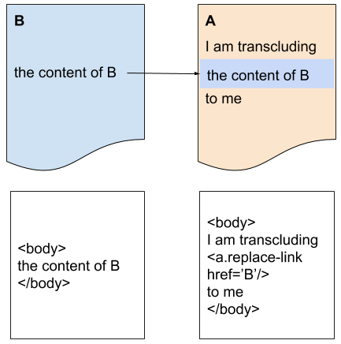
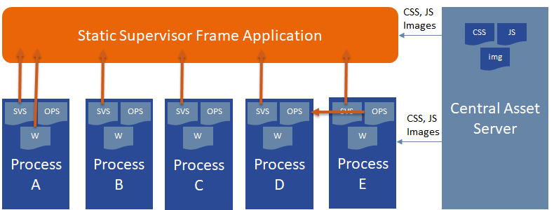
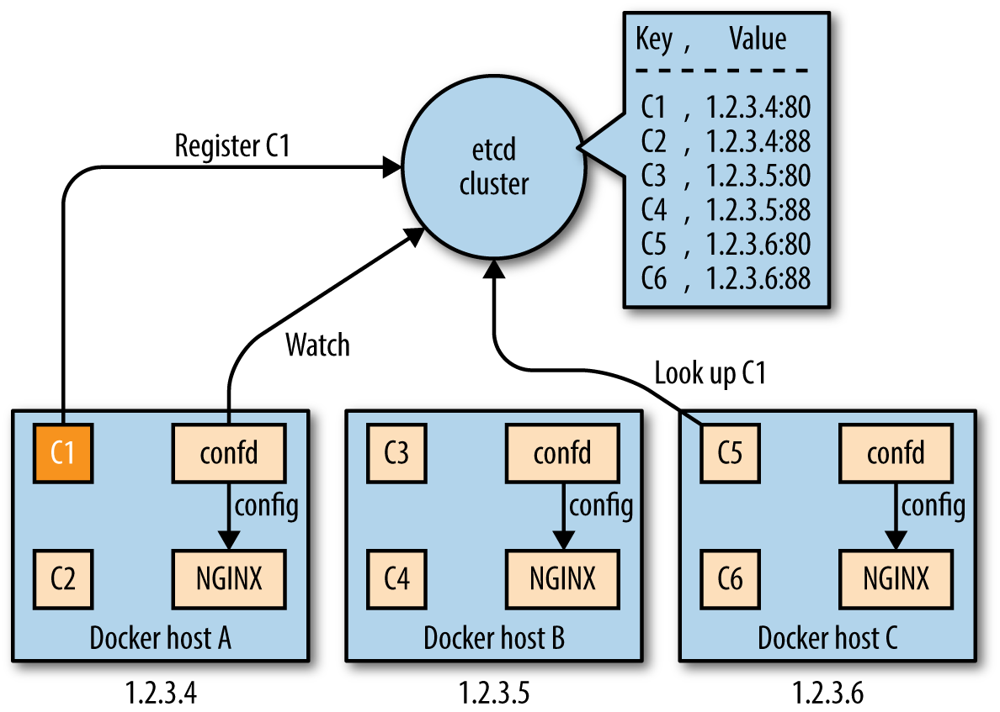

== Static Enterprise Portal Application

For the realizastion of a Enterprise Portal frame application,the decision was made to stay also modularized and not to go for a monolithic approach.

=== Realization
To realize this one, you need to make use of a technique called Transclusion. So all UIs, including the Enterprise Portal Fragments, the Operator Workstations and also all Dashboard Widgets
are being developed and delivered by the corresponding context team and are implemented as WebComponents. 

=== Delivery
Delivery of the components will take place inside of a Docker container delivered by the context team.

=== Modularity
As already described, the Macro Architecture Team tries to avaoid a UI monolith to keep independence between teams on the UI level as high as in the backend.

Domain Driven Design makes it possible to reach that goal by defining a system as a set of business processes that together form an overall process.

=== Web based

image::../../../images/concept/ui/HTML5_logo_and_wordmark.svg.png[HTML,205]
image::../../../images/concept/ui/CSS.3.svg.png[CSS,145]
image::../../../images/concept/ui/js-strict.svg.png[JS,159]

To get a good testability and a modularization of the UIs, you will have to structure them with HTML5, make them alive using JavaScript and make them look alike one application using css.

All asset like css, javascript or images are available by consuming them from a centralized link:Central_Asset_Server.adoc[asset server].

It will be necessary to integrate information of a foreign service inside of your own, therefor a technique called Transclusion is used.

=== Transclusion

For more details about the transclusion concept, please visit the concept page.

=== Central Asset Server
All common assets are provided by a link:Central_Asset_Server.adoc[centralized asset server].

* CSS Files
* JavaScripts
* Image File

=== Static Enterprise Portal Application

==== How does the Static Enterprise Portal Application knows the available Services?
In general the static SVS frame does not know anything about the availability of services in a system.

It will ask the Kubernetes Service Discovery to provide a list of available services.

Once it received a list of services, the static application will start sniffing the /.well-known/Enterprise Portal-screens metadata file of the services to fetch information about available SVS screens, possible dashboard widgets or others. 
After that, the application will build up the menu structure that results out of the available services.