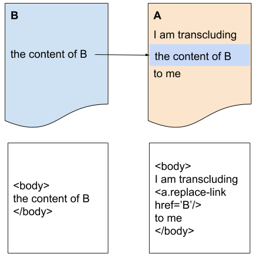

== Transclusion Concept

Self contained systems 'SCS' provide a way to build systems that each have their own UI and to ensure that they look like one uniform system when a user has a look onto it.

Therefore it is necessary to have a way to integrate the various UIs of the different SCSs

There are a lot of different approaches how to integrate systems in the web frontend. The Macro architecture team has decided to go for the concept called Transclusion.

Transclusion of HTML over systems is conceptually the approach of replacing a link, that formerly has been fetched out of a /.well-known/xxx metadata file, with the content of a <body> tag received from a HTTP request that has been accepted with an:

[source]
----
Accepted: text/html
----

NOTE: In this case, the data of document B is transcluded into document A.

=== Options for Transclusion
Imagine, a warehouse system based on Self Contained Systems. One of its SCSs is responsible to show details of issues like conveyor motor issues e.t.c in a warehouse, another SCS is responsible for the logistical process that is being fulfilled, it may be reasonable to show the status of the conveyor motor directily with the logistical process information in an overview. If this integration of information in the frontend is planned to happen by using transclusion ther eare two different ways to solve this:

* Transclusion in a webserver or a reverse proxy
* Transclusion in the browser by AJAX

=== Server Side Includes
The first approach would be named Server Side Includes 'SSI'. SSI could be an option. SSI will parse the HTML page for placeholders (for example <ssi:include src='http://my.service.com/foo/bar'>) in a webserver. For each placeholder, a URI is extracted and a HTTP GET request is being executed to fetch the content of the target URI and replace the placeholder by it.

In this approach it is very depending on the responsetime of the webserver because before the webserver can deliver the page, it is neccessary to replace all <ssi:include> tags in the page by the content of the taget URI wich might result in a relatively low response time. The pro of this approach is that the page can be indexed by for example the google bot.

NOTE: The Macro architecture team has decided not to go for this approach because of the fact that a huge amount of transclusions within one HTML page might result in a very slow response time and because we simply do not need a bot to index our UIs.

=== Client Side Includes

The second variant of Transclusion are Client Side Includes 'CSI'. It means that the replacement of the placeholders by the content of a URI is being executed on client side.

To execute a CSI with a few lines of JQuery the code would probably look like this:

[source, JavaScript]
----
$('a.replace-link').each(function() { 

 var link = $(this); 

 var content = $('

').load(link.attr('href'), function() { 

 link.replaceWith(content); 

 }); 

});
----

This example would only work if the target links are compliant to the requirements of the same origin policy SOP. This approach benefits from the fact that all transclusions are being executed independentely from each other asynchronously which means if an error occurrs, it will only have local effect to the specific transclusion. Further it brings the benefit that just a sub tree of the target URI could be transcluded instead the whole content of the <body> tag for jQuery see JQL. 

Another way to realize Client Side Includes uses Web Components. See Include Web Component Concept for a description.

=== The Main Question

At the end of the day, it is about the question of which static assets (CSS and JavaScript) get pulled in and where they are coming from. The Macro architecture team has decided to for the approach of having a central asset server (probably a Nginx server) that provides all the neccessary assets to be included in a HTML page.

The responsiblilty for this content will be at the UI/UX team.

Further, the question in such a situation is how to include the assets of with a specific version in the URL. You typically want to provide assets that are most valuable for the:

[source]
----
Cache-Control: max-age
----

directive. This problem can be best addressed on https://tools.ietf.org/html/draft-nottingham-json-home-02[JSH].
