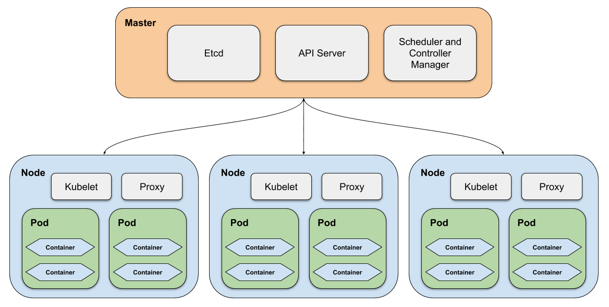

[[section-deployment-view]]

== Deployment View

As described before, every developed service should run within a Docker container. This allows us to use a Docker container orchestration software, which eases the deployment of a whole system. The container orchestration software, that will be used is Kubernetes. Kubernetes is an open-source system for automating deployment, scaling and management of containerized applications, like applications in Docker-containers.

Kubernetes can either run in a foreign-hosted cloud-environment, like IBM Cloud, or it can be self-hosted on own hardware. This could either be a casual server at the customer-site or a self-hosted cloud of Swisslog. There are several possibilities to get the system running.

Of course there have to be additional hardware to get the user interfaces running, like thin clients and handheld-terminal devices.

[[immutable-infrastructure]]
== Immutable infrastructure

Immutable infrastructure is comprised of immutable components that are replaced for every deployment, rather than being updated in-place. Every software update is treated like a new rollout, without consideration of what have been deployed before and without patching the existing resources.

Immutable components are on the one hand deployable services, in our case software container, but also configuration files.