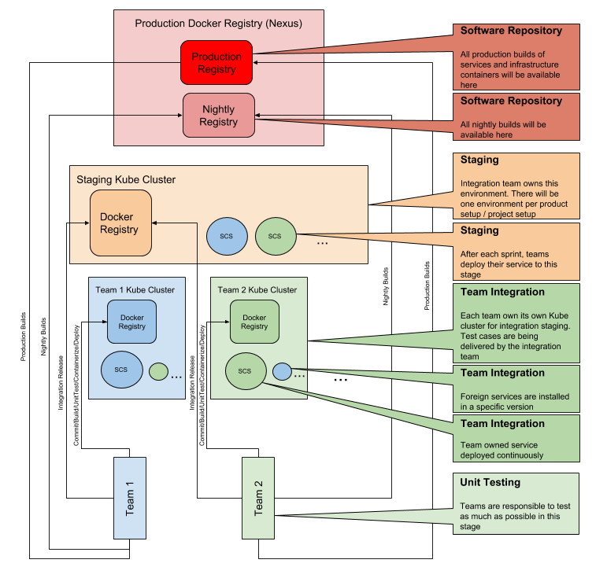
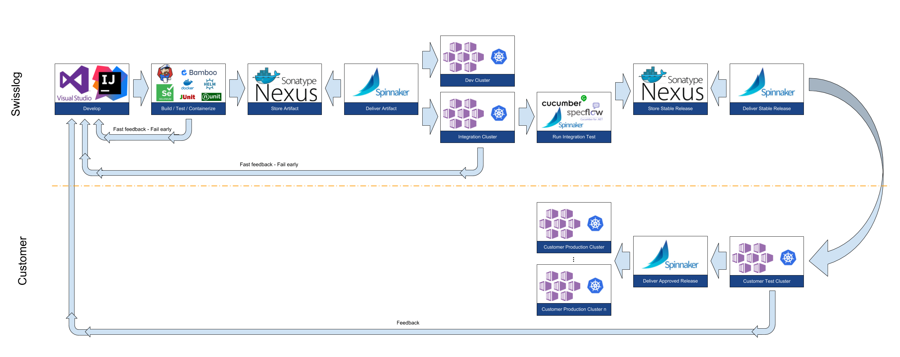

[[section-quality-scenarios]]
== Quality Requirements

=== Quality Guideline

.Our Quality Vision ...
NOTE: ... is to have a fully automated testing strategy for the software consisting of multiple Self Contained Systems. 

* Testing should be done as soon as possible to provide fast feedback to the developers. 
* Almost all tests should be automated. 
* Everyone is responsible to deliver high quality.
** Scrum teams must define definition of done
*** Possible guidelines
*** Format of documentation
*** Code coverage
*** Code analysis / Continuous Code Quality (e.g. Ndepend for C#, SonarQube)

=== Level of Testing
The testing approach in SCS related environments is a bit different than the approach you would choose when being with a functional decomposed system.
Functional decomposed systems can earliest being tested integrative when all process related functionalities are available.
Not so with an SCS approach. SCSs can be integrative tested in a relatively early stage which is the reason why you can write automated integration tests using unit test tools and make it a concern of the development team.   

In the drawing below, you see how an automated testing approach setup could look like.

=== Definition of Software Test types
To meet our demands for quality we need to realize that we have to execute various types of tests.

==== Unit Test

.Unit Test
NOTE: A Unit Test is basically testing the behaviour of a single class (unit)
in isolation. The behaviour of collaborating classes are mocked. 

==== Acceptance Test
.Acceptance Test
NOTE: An Acceptance Test tests, if a user story is fulfilled and accepted by the user/product owner. 

[quote, http://softwaretestingfundamentals.com/acceptance-testing/]
____
Formal testing with respect to user needs, requirements, and business processes conducted to determine whether or not a system satisfies the acceptance criteria and to enable the user, customers or other authorized entity to determine whether or not to accept the system.
____

==== Component Test

.Component Test
NOTE: A white box test is a test of the whole Self Contained System.

[quote, https://martinfowler.com/articles/Self Contained System-testing/#testing-progress-3]
____
A Component Test limits “the scope of the exercised software to a portion of the system under test, manipulating the system through internal code interfaces and using test doubles to isolate the code under test from other components.”
____

==== Interface Test

.Interface Test
NOTE: Contract Test is a substitute for Interface Test.

[quote, https://martinfowler.com/articles/Self Contained System-testing/#testing-contract-introduction, quote]
____
An Interface Test is a test at the boundary of an external service verifying that it meets the contract expected by a consuming service.
____

* This test is provided by the consuming team, and executed by the development team of the Self Contained System.

==== Integration Test

.Integration Test
NOTE: An Integration Test verifies the communication paths and interactions between components to detect interface defects. 

==== End-to-End Test

[quote, https://martinfowler.com/articles/Self Contained System-testing/#testing-end-to-end-introduction]
____
An End-to-End Test verifies that a system meets external requirements and achieves its goals, testing the entire system, from end to end.
____

==== User Interface Test

.User Unterface Test
NOTE: A User Interface Test verifies the correct behaviour of the graphical user interface. 

* Elements are enabled/disabled 
* Error messages are shown, 

=== Quality Pipeline
Nowadays it is quiet important to automate the build, test and delivery process as much as possible to guarantee a fast feedback and to enable Swisslog to be able to react on first day exploits within the 24 hours time frame that you get whenever an exploit is being identified.

NOTE: A Continuous deployment solution such as Spinnaker, provides you with the necessary configuration management abilities in a central place as well.

* To automate the whole prcess of CI/CD, a proper process including tooling is the precondition.
* After a team has created some new source code, it runs automatic build, unit test and containerization.
* Once, the unit tests and containerization are passed, the software is being delivered as a so-called artifact into the central artifact repository. 
* From here on, Spinnaker starts pulling – following the logic of a deployment pipeline – the artifact from the central repository and deploys it into either a development or one or more integration environment.
* In integration environments Spinnaker triggers specification by example test scenarios that forming the process tests of a specific system.
* After successfull executed integration tests, Spinnaker marks the tested software as a stable release and stores it into the production ready software repository.
* A continuous deployment solution delivers – following the logic of a deployment pipeline – the stable release software either in a customer specific on-site test environment where the customer may makes use of the manual approval functionality to further roll out the software to one or more production environments where a so-called canary rollout strategy could be used to roll out a software version besides the current version and to measure the behavior of the software compared to the behavior of the production version. Once again a manual approval task can be used to fully bring the new version of the software into production.
* At all time a fast feedback loop to at least the development team is guaranteed. The channels of information transfer can be extended by for example the use of DevOps tools like slack to deliver information about system behavior or issues in a system very fast to the desired parties.

=== Quality Scenarios
TODO
